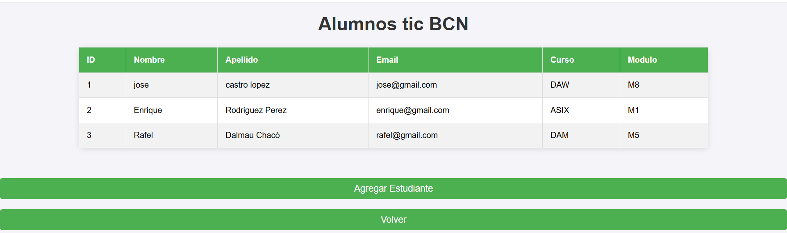
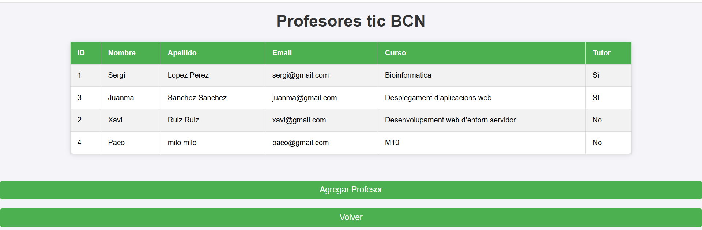
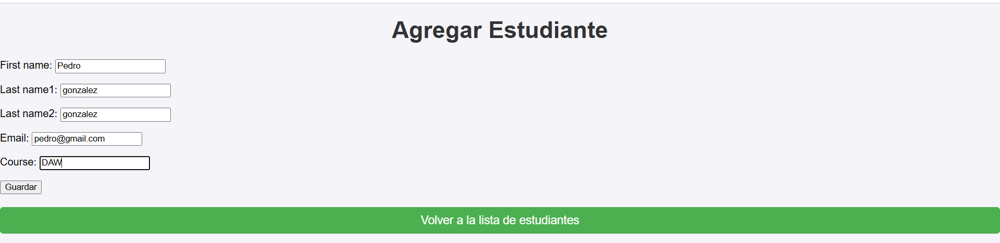
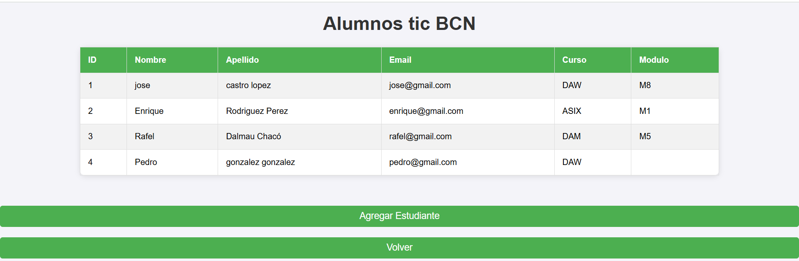
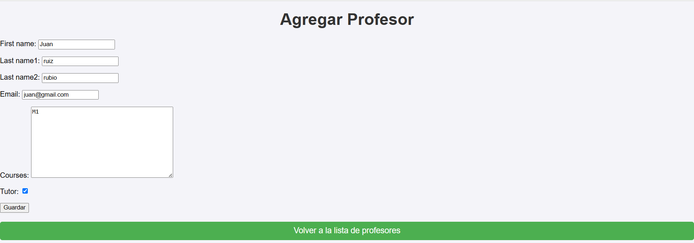
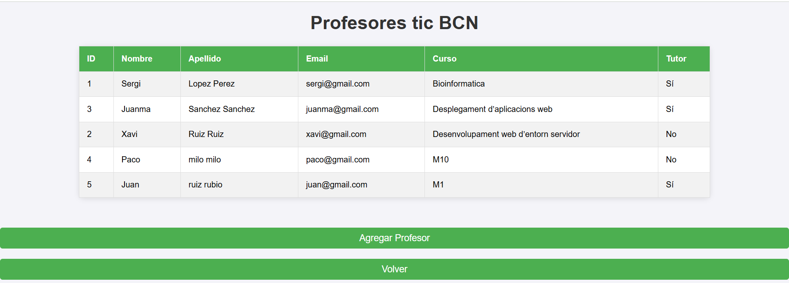

# Practica 13 Django

## URL centre/students

## URL centre/teachers

## Formulario de students

## Student añadido correctamente

## Formulario de teachers

## Teachers añadido correctamente

